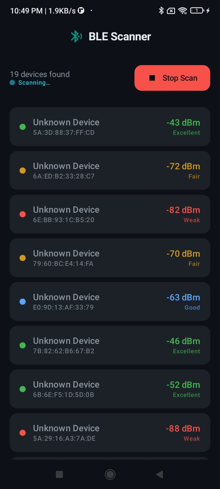
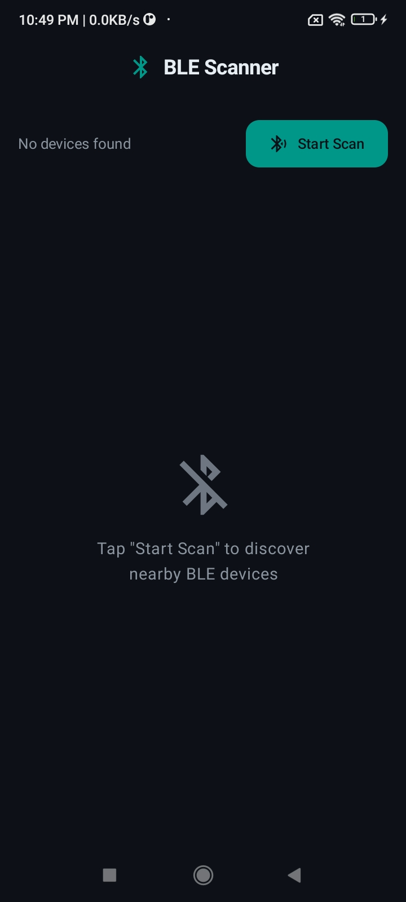

# 📱 BLE Scanner

A modern, cross-platform Bluetooth Low Energy (BLE) device scanner built with **Kotlin Multiplatform (KMP)** for Android and iOS.


---

## ✨ Features

- 🔍 **Real-time BLE Device Discovery** - Discovers nearby Bluetooth Low Energy devices
- 📊 **Signal Strength Display** - Shows RSSI (Received Signal Strength Indicator) with color-coded strength indicators
- 🎨 **Material Design 3 UI** - Modern dark theme with smooth animations
- ⚡ **Cross-Platform** - Share 100% of business logic between Android & iOS
- 🔄 **Live Updates** - Real-time device list with animated RSSI changes
- 🛡️ **Permission Handling** - Proper Android 12+ granular permissions with legacy support
- 💾 **State Management** - Reactive MVI architecture with Kotlin StateFlow
- 🎯 **MVI Architecture** - Single state, typed actions, Koin dependency injection

---

## 📸 Screenshots

<div align="center">

### Android



</div>

---

## 🏗️ Architecture

### Multi-Module Structure

```
BLE Scanner (Root)
├── shared/              (Business logic - Kotlin Multiplatform)
│   ├── commonMain/      (Shared interfaces and models)
│   ├── androidMain/     (Android-specific implementations)
│   └── iosMain/         (iOS-specific Kotlin wrappers)
├── androidApp/          (Android UI - Jetpack Compose)
│   ├── di/              (Koin dependency injection)
│   ├── ui/
│   │   ├── screen/      (Root + Screen composables - MVI)
│   │   ├── components/  (Reusable components)
│   │   └── theme/       (Material Design 3 theming)
│   ├── viewmodel/       (MVI ViewModel, State, Action)
│   ├── permissions/     (Android permission handling)
│   └── MainActivity.kt  (Entry point)
└── iosApp/              (iOS UI - SwiftUI)
    ├── iosApp/
    ├── IOSBleScanner.swift  (CoreBluetooth bridge)
    └── ContentView.swift    (SwiftUI UI)
```

---

## 🚀 Quick Start

### Prerequisites

- **Kotlin 1.9.22+**
- **Gradle 8.5+**
- **Android SDK 34** (compileSdk)
- **Xcode 15+** (for iOS)
- **macOS 13+** (for building iOS)

### Build & Run

#### Android
```bash
# Build Android app
./gradlew androidApp:build

# Run on Android emulator/device
./gradlew androidApp:installDebug

# Run tests
./gradlew test
```

#### iOS
```bash
# Build shared framework
./gradlew shared:build

# Open iOS app in Xcode
open iosApp/iosApp.xcodeproj

# Run in simulator
xcodebuild -scheme iosApp \
  -configuration Debug \
  -derivedDataPath build \
  -arch arm64 \
  -sdk iphonesimulator
```

---

## 📋 Requirements

### Android
- **Minimum SDK**: Android 7.0 (API 24)
- **Target SDK**: Android 14 (API 34)
- **Required Permissions**:
  - `android.permission.BLUETOOTH_SCAN` (Android 12+)
  - `android.permission.BLUETOOTH_CONNECT` (Android 12+)
  - `android.permission.ACCESS_FINE_LOCATION` (Android 11 and below)
  - `android.permission.ACCESS_COARSE_LOCATION` (Android 11 and below)

### iOS
- **Minimum Deployment Target**: iOS 14.0
- **Required Capabilities**:
  - Bluetooth (NSBluetoothPeripheralUsageDescription in Info.plist)
  - Required background modes: "Uses Bluetooth LE accessories"

---

## 🔧 Tech Stack

### Shared Module
- **Kotlin Coroutines** - Asynchronous programming
- **StateFlow** - Reactive state management
- **KMP** - Multiplatform code sharing

### Android
- **Jetpack Compose** - Declarative UI
- **Material Design 3** - Modern theming
- **AndroidX ViewModel** - MVVM architecture
- **BluetoothAdapter** - Native BLE scanning

### iOS
- **SwiftUI** - Declarative UI
- **CoreBluetooth** - Native BLE scanning
- **Combine** - Reactive programming

---

## 📱 How It Works

### Data Flow

```
┌─────────────────────────────────────────────┐
│ User taps "Start Scan"                      │
└────────────────┬────────────────────────────┘
                 ▼
┌─────────────────────────────────────────────┐
│ BleScannerAction.OnToggleScan dispatched    │
└────────────────┬────────────────────────────┘
                 ▼
┌─────────────────────────────────────────────┐
│ BleViewModel.onAction() → startScan()       │
└────────────────┬────────────────────────────┘
                 ▼
┌─────────────────────────────────────────────┐
│ AndroidBleScanner / IosBleScanner           │
└────────────────┬────────────────────────────┘
                 ▼
┌─────────────────────────────────────────────┐
│ System discovers BLE device                 │
└────────────────┬────────────────────────────┘
                 ▼
┌─────────────────────────────────────────────┐
│ BleScannerState updated via StateFlow       │
└────────────────┬────────────────────────────┘
                 ▼
┌─────────────────────────────────────────────┐
│ Compose recomposes and renders DeviceRow    │
└─────────────────────────────────────────────┘
```

### Key Components

#### BleDevice (Shared Model)
```kotlin
data class BleDevice(
    val name: String?,           // Device advertised name
    val macAddress: String,      // MAC address (Android) or UUID (iOS)
    val rssi: Int               // Signal strength in dBm
)
```

#### BleScanner (Shared Interface)
```kotlin
interface BleScanner {
    val scannedDevices: StateFlow<List<BleDevice>>
    val isScanning: StateFlow<Boolean>
    
    fun startScan()
    fun stopScan()
}
```

---

## 🎯 RSSI Signal Strength

The app displays signal strength using RSSI (Received Signal Strength Indicator) values:

| RSSI Range | Label | Color | Meaning |
|-----------|-------|-------|---------|
| -30 to -50 dBm | Excellent | 🟢 Green | Very close, strong signal |
| -50 to -70 dBm | Good | 🟡 Yellow | Close, good signal |
| -70 to -85 dBm | Fair | 🟠 Orange | Moderate distance |
| -85 to -100 dBm | Weak | 🔴 Red | Far away, weak signal |
| < -100 dBm | Very Weak | ⚫ Dark Red | Very far or obstructed |

---

## 📖 Documentation

- [**SETUP_GUIDE.md**](SETUP_GUIDE.md) - Development environment setup
- [**Screenshots**](screenshots/) - UI screenshots and demos

---

## 🔐 Permissions & Privacy

### Android
- Runtime permission requests for Bluetooth access
- Location permission required on Android 11 and below (BLE scanning requirement)
- No personal data collection

### iOS
- Requires user permission via Info.plist
- Uses CBPeripheral UUID instead of MAC addresses (Apple privacy policy)
- No personal data collection

---

## ⚙️ Configuration

### Android Manifest
Key permissions are declared in `androidApp/src/main/AndroidManifest.xml`:

```xml
<uses-permission android:name="android.permission.BLUETOOTH_SCAN" />
<uses-permission android:name="android.permission.BLUETOOTH_CONNECT" />
<uses-permission 
    android:name="android.permission.ACCESS_FINE_LOCATION"
    android:maxSdkVersion="30" />
```

### iOS Info.plist
Required entries:
```xml
<key>NSBluetoothPeripheralUsageDescription</key>
<string>We need Bluetooth to discover nearby BLE devices</string>
<key>UIBackgroundModes</key>
<array>
    <string>bluetooth-central</string>
</array>
```

---

## 🐛 Known Limitations

- iOS doesn't expose MAC addresses (uses CBPeripheral UUID instead)
- RSSI values fluctuate based on signal conditions
- Background scanning on iOS requires special capabilities

---

## 🤝 Contributing

1. Fork the repository
2. Create a feature branch (`git checkout -b feature/amazing-feature`)
3. Commit your changes (`git commit -m 'Add amazing feature'`)
4. Push to the branch (`git push origin feature/amazing-feature`)
5. Open a Pull Request

---

## 📄 License

This project is licensed under the MIT License - see the [LICENSE](LICENSE) file for details.

---

## 👨‍💻 Author

**Uday Sah**
- GitHub: [@udaysah](https://github.com/udaysah)

---

## 🙏 Acknowledgments

- [Kotlin Multiplatform Documentation](https://kotlinlang.org/docs/multiplatform.html)
- [Jetpack Compose](https://developer.android.com/jetpack/compose)
- [SwiftUI](https://developer.apple.com/swiftui/)
- [Material Design 3](https://m3.material.io/)

---

## 📞 Support

For issues, questions, or feature requests, please open an [issue](https://github.com/udaysah/ble-scanner/issues) on GitHub.

---

<div align="center">

**⭐ If you find this project helpful, please consider giving it a star!**

</div>

